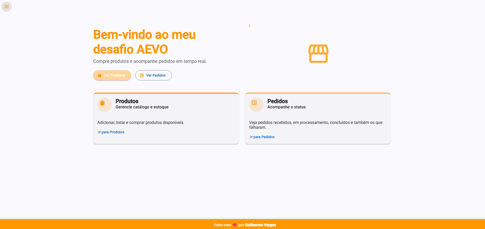
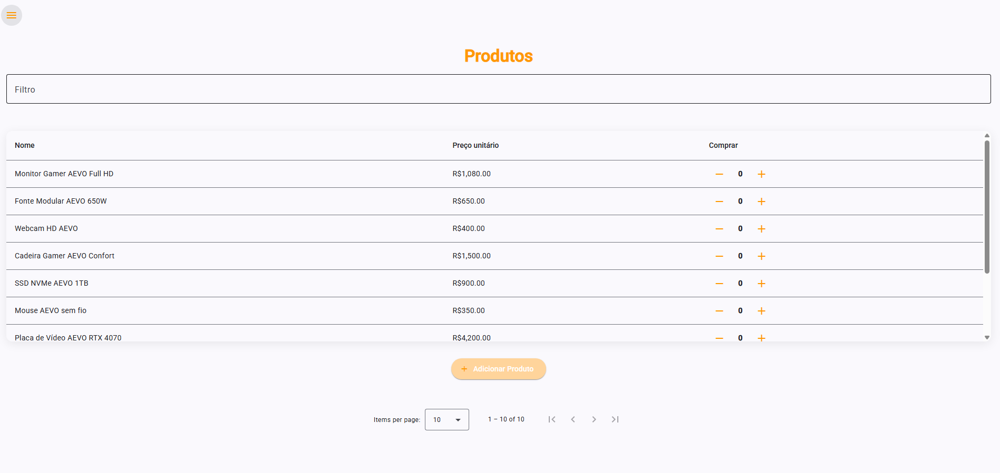
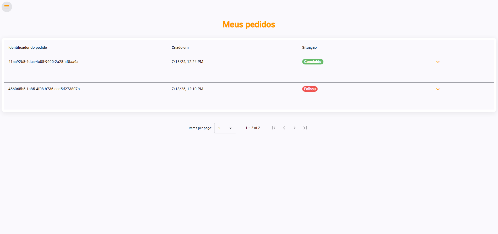
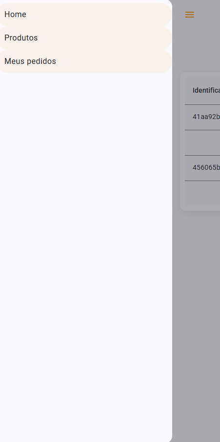

# Desafio AEVO - E-commerce (Angular + .NET + RabbitMQ)

Este projeto foi desenvolvido como parte do desafio técnico da AEVO.
O objetivo é criar uma aplicação de e-commerce com **.NET 8 (C#)** no backend, **Angular 17** no frontend e **RabbitMQ + MassTransit** para processamento assíncrono dos pedidos.

---

## 🚀 Tecnologias Utilizadas

### Backend
- .NET 8 + ASP.NET Core Web API
- Entity Framework Core
- FluentMigrator (migrações)
- FluentValidation (validações)
- FluentAssertions (testes)
- MassTransit + RabbitMQ (mensageria)
- DDD (Domain Driven Design)
- Xunit + Bogus (testes)
- Dapper (lib auxiliar em testes)

### Frontend
- Angular 17
- Angular Material
- RxJS

### Infraestrutura
- Docker + Docker Compose (API, RabbitMQ, SQL Server)
- SQL Server

---

## 📂 Estrutura do Projeto

DesafioAEVO/
│
├── docker-compose.yml
├── Dockerfile
│
├── API/
│ ├── Controllers/
│ ├── Extensions/
│ ├── Program.cs
│ └── ...
│
├── Application/
│ ├── UseCases/
│ ├── Validators/
│ ├── AutoMapper/
│
├── Domain/
│ ├── Entities/
│ ├── Repositories/
│
├── Infrastructure/
│ ├── Data/
│ ├── Messaging/
│
├── shared/
│ ├── DesafioAEVO.Communication/
│ └── DesafioAEVO.Exceptions/
│
├── frontend/
│ ├── components/
│ ├── includes/
│ ├── interfaces/
│ ├── services/
│ ├── models/
│ └── material/
│
└── tests/
├── CommonTestUtilities/
├── UseCases.Test/
└── Validators.Test/

---

## ✅ Funcionalidades Implementadas
- **Produtos**
  - Cadastro de produtos via API
  - Listagem paginada no frontend com Angular Material Table
  - Seleção de múltiplos produtos e simulação de compra
  - Testes de cadastros

- **Pedidos**
  - Criação de pedidos enviando itens selecionados
  - Processamento assíncrono via RabbitMQ + MassTransit
  - Atualização do status do pedido (Recebido → Em Processamento → Concluído / Falhou)
  - Tela de pedidos com auto-refresh a cada 30s
  - Testes de cadastros e de fila

  ---

  ### ✅ 1. Backend (.NET API)

  ## Como Rodar o Projeto
- cd src/DesafioAEVO.API
- dotnet restore
- dotnet build
- dotnet run
- Lembrar de startar o RabbitMq se rodar a api sem ser pelo Docker.

Ao executar, será feita a migração do banco com dados iniciais (DatabaseMigration + DataSeeder).

Swagger disponível em:
➡ http://localhost:7090/swagger
  
  ### ✅ 2. RabbitMQ via Docker

- **Docker Desktop** instalado e rodando (https://www.docker.com/products/docker-desktop)    
- Internet para baixar imagens Docker na primeira execução  

  ## Subir containers API, RabbitMQ e SQL Server
-  docker compose up --build -d
  ## Para ver os containers em execução
- docker ps

  ## RabbitMQ Management UI
- http://localhost:15672/#/
  **(user: guest | pass: guest)**

  Com o Docker, as credenciais do banco padrão são:
- **Server name**: localhost,1433
- **Authentication**: SQL Server Authentication
- **User**: sa
- **Password**: SQLServer@2025
- **Database**: DesafioAEVO

  ## Para remover os containers se precisar
- docker compose down -v

  ### ✅ 3. Frontend (Angular)
- Instale as dependências
- npm install
- npm install -g @angular/cli
- npm install @angular/material@latest
- npm install -D sass@latest
- npm install ngx-mask --save
- ng serve

### Configuração do Banco de Dados
A API utiliza **SQL Server**. No `appsettings.json`, atualize a `ConnectionStrings:ConnectionSQLServer` com os dados do seu ambiente.

Exemplo:
"ConnectionStrings": {
  "DefaultConnection": "Data Source=VARGASPC; Initial Catalog=desafioAEVO; User ID=sa; Password=********;Trusted_Connection=True;Encrypt=True;TrustServerCertificate=True"
}

## Uri Front http://localhost:4200
## Uri Back https://localhost:7090 | http://localhost:5284

No front instanciei as urls dos serviçoes para a porta 5284, para não dar erros de permissões e de certificados no Docker.

---

## Endpoints
- GET /products → Lista todos os produtos
- POST /products → Cria um novo produto
- POST /orders/create → Cria um novo pedido (enfileira no RabbitMQ)
- GET /orders → Lista todos os pedidos com seus itens

## Processamento Assíncrono
- O pedido é salvo no banco e publicado no RabbitMQ
- Um consumer (MassTransit) processa a mensagem e atualiza o status do pedido
- Status possíveis:
- Recebido
- Em Processamento
- Concluído
- Falhou

## Como Simular a Mensageria
- Verifique se o RabbitMq está instalado e executando na sua maquina.
- Crie um pedido pelo Frontend ou pelo Swagger.
- Acompanhe a fila no RabbitMQ Management UI (order-created-queue)
- Veja o status mudar na tela de pedidos após alguns segundos, e consulte no banco de dados os dados sendo alterados.

## Telas

## Observações
- Projeto segue os princípios do DDD
- Implementa boas práticas de Clean Code
- Código modular e extensível para futuras melhorias

Feito com ❤️ para o desafio técnico da AEVO, espero que gostem :).